# Overview
I want ambient light in my Tesla Model 3. More, I want it to react to car controls.
## Ideas:
- Show blind spot alerts when changing lanes
- Show turn signals
- Show gear by short animation
- Indicate open doors
- Indicate seat heat
- Indicate unlatched seatbelt
- Whatever...

It should also response to day/night ambient light, don't disrupt or disturb, and look fancy.

Installation without cutting any wire.

# Demo
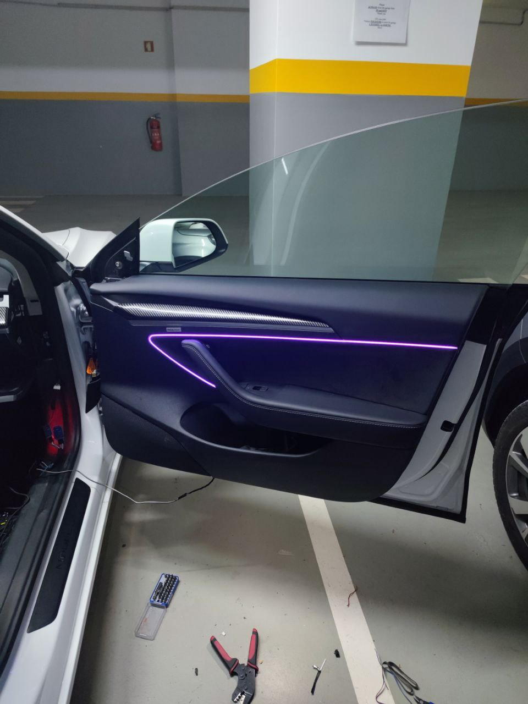
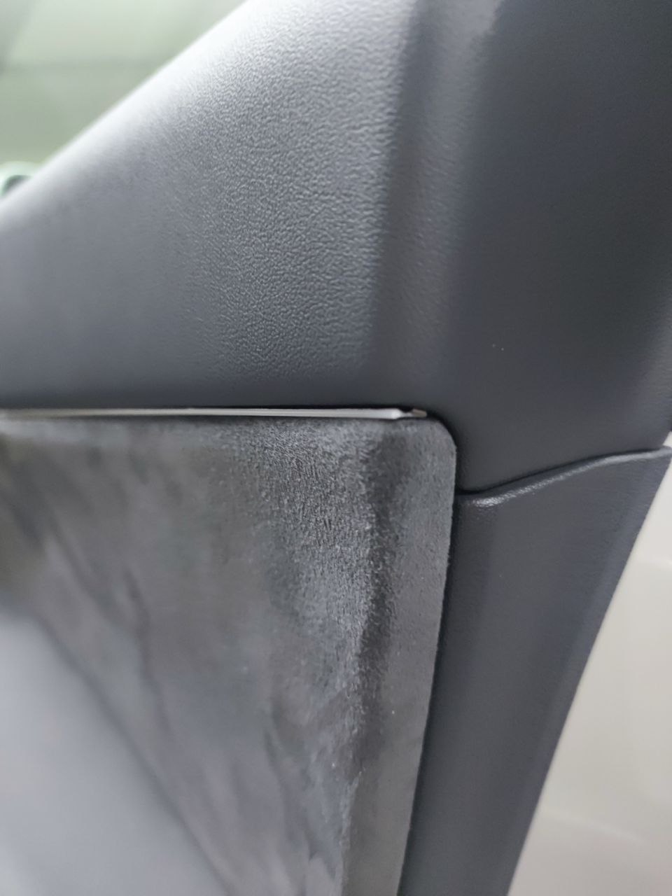

https://www.youtube.com/shorts/Xc-fdAo0e8E

# Concept

ESP32 as master module, connected to Vehicle CAN and Chassis CAN with two MCP2515.

4 ESP32 in each door connected to master module and controlling LED strips.
I've decided to put ESP32 in each door because central ESP32 can't control address LED strip due to electric noise. Too long wires to work with shift register.
Reasonable solution is to use CAN, but I don't want to put another wires. So, Wi-Fi and UDP protocol is the best option for me.

My TM3 is RWD, it has door pocket lights but they are inactive. I took these wires for power delivery. See "wiring" below.

# Requirements

## Tools
- Pliers
- Dupont terminals crimper (optional)
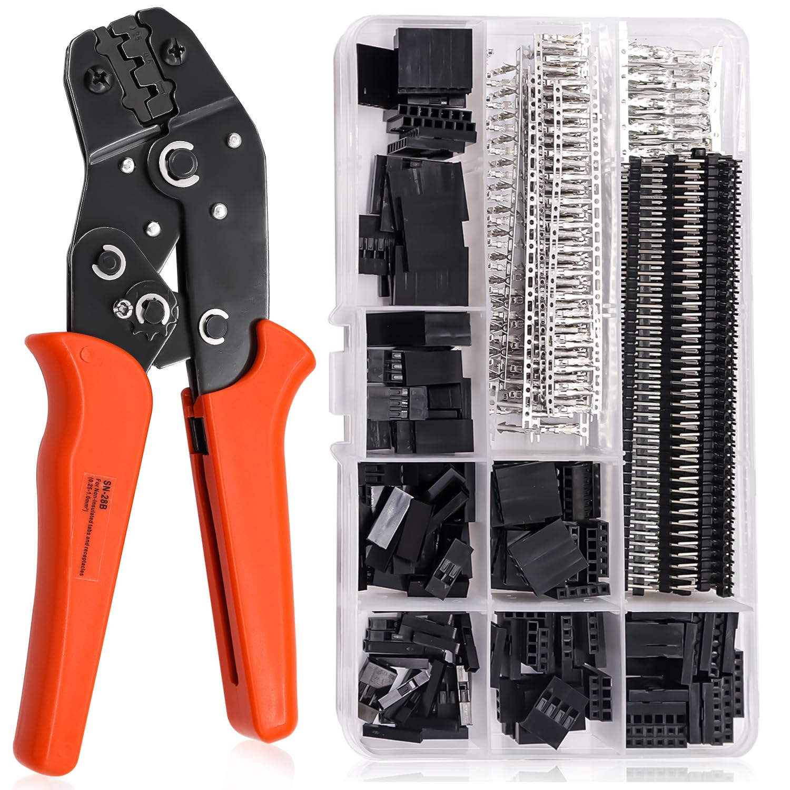
- Soldering iron
- Pry tool
- Torx set
- Needle to change pins

## Components
- ESP 32 (with USB) x5
- MCP2515 x2
- DC-DC converter (1 or more)
- Tesla CAN connector. If you can`t find one with 6 wires (2 big pins for power, which have no corresponding pins in the car and 2x2 for CAN buses), buy 2 and move pins. Or take pins from the next one, there are unused ones. 
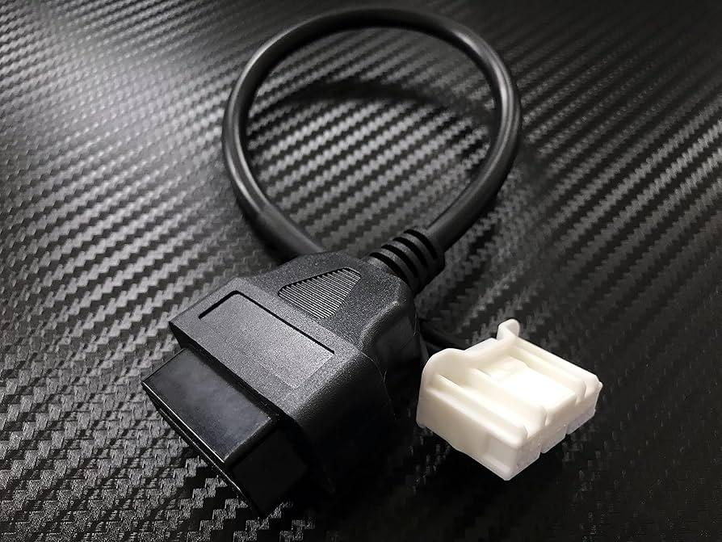
- Tesla Diagnostic Breakout (optional). Use to get power from central console socket without cutting wires.
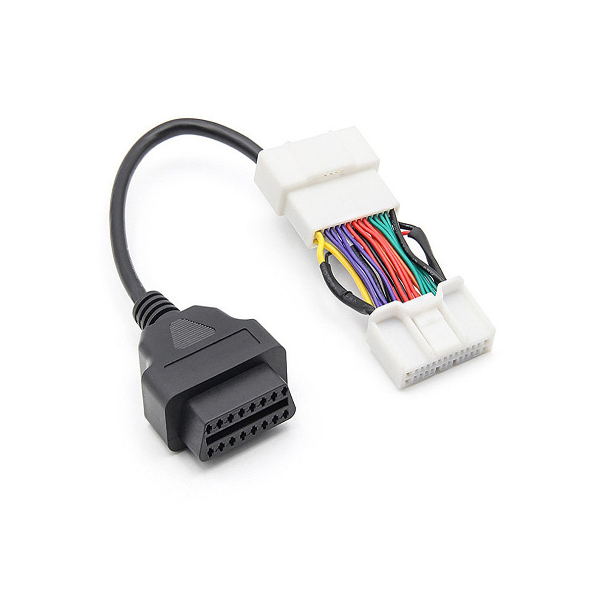
- Insulating tape
- Soundproofing tape
- Fuse with holder

**Please, make sure you know what to do and have an experience with electricity. Disconnect both batteries before proceed.
Do this at your own risk.**

# Wiring

## Master module

Pretty standard SPI wiring. Chip Select wires should correspond to `Car.init(13, 5)` call

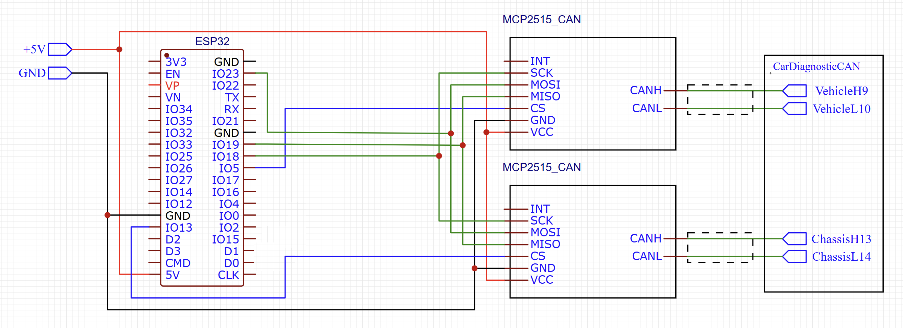

## Door module

Test LED strip wires before connecting. Mine had black wire for 5V and red for GND. RIP, LED strip.

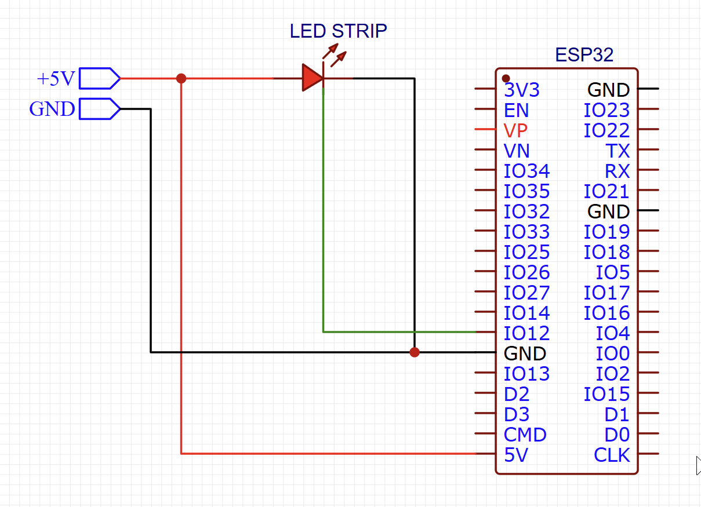

## Car connectors and pins

### CAN connector

Here how it looks. I used Tesla CAN connector, just plugged in to empty connector, just cut out OBD connector and soldered wires directly to my MCP2515 adapters. 
Don't forget to twist wires.
Refer to car wiring diagrams.
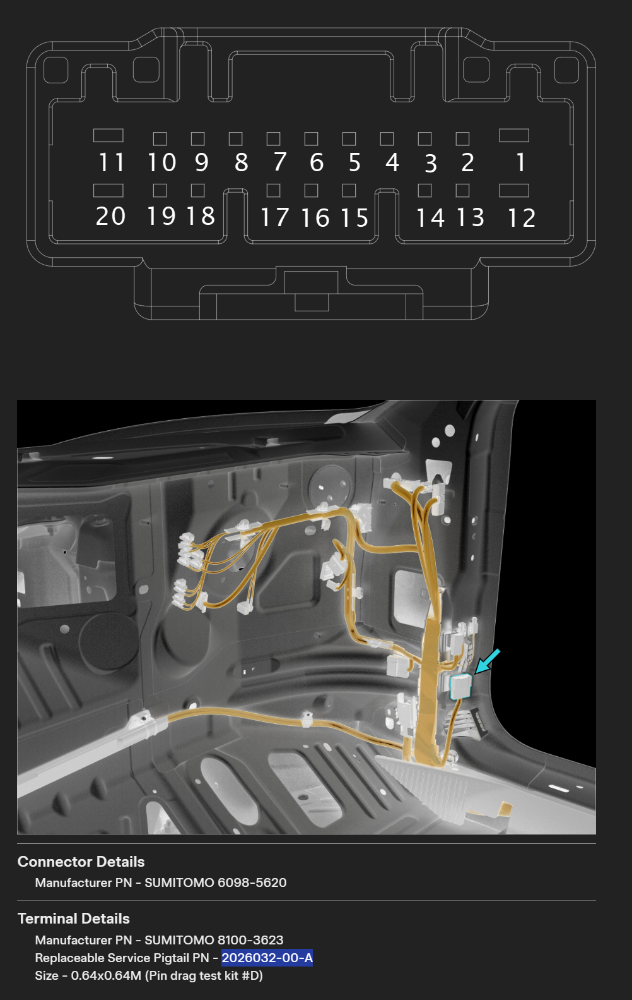
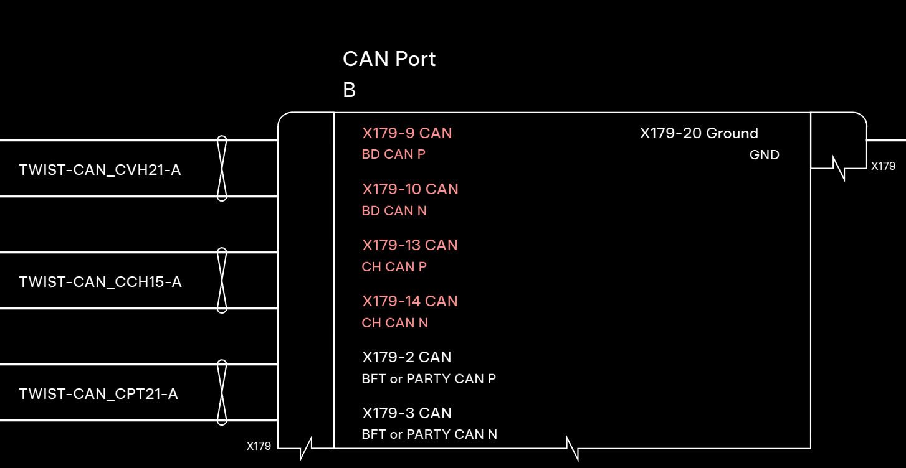

## Power connector
Use power from central console. Check polarity before connection, don't trust wire colors.
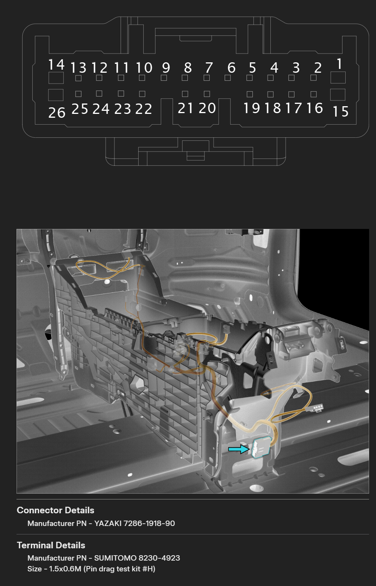
I've installed 5A fuse, put wrapped wire to under-the-glovebox area, where are a lot of space, and CAN connector located. 

## Door module power
There are 4 pins, one for each door, connected to VCLEFT and VCRIGHT, on RWD there are no voltage.
Anyway, I don't think it's a good idea to put additional load, so I've taken these pins out of the connectors and connected them to my own power source.
### Front doors
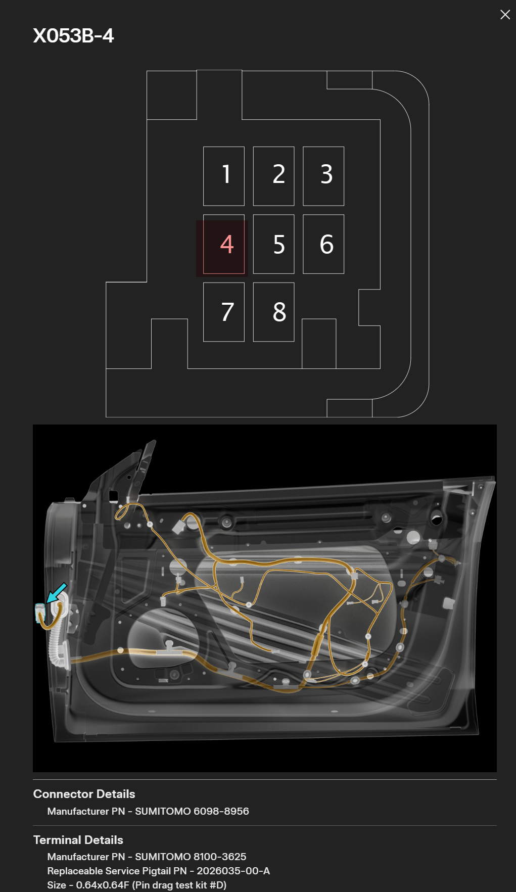
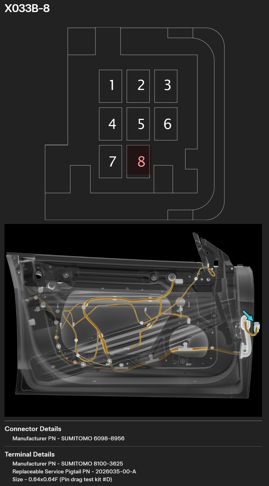
### Back doors
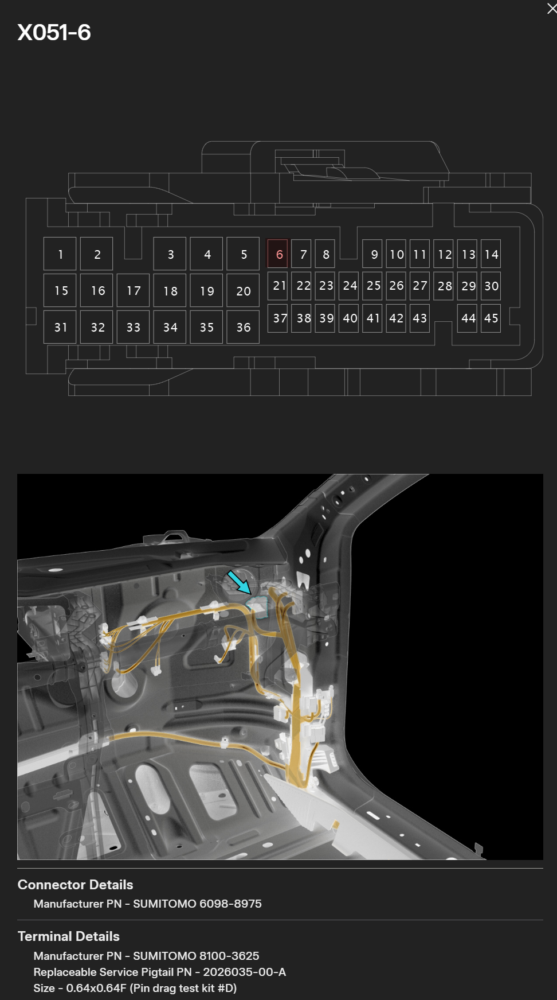
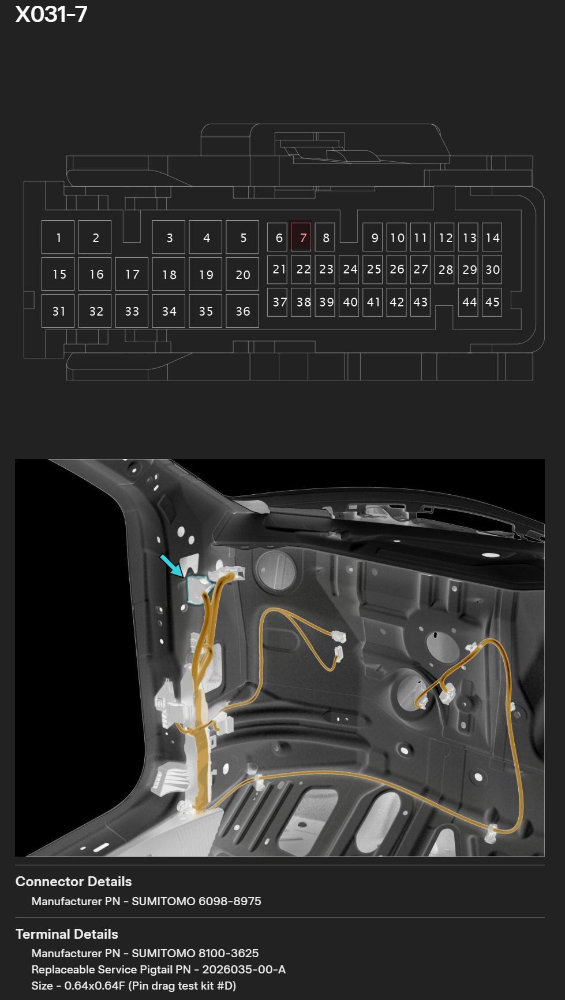

# Used resources

https://service.tesla.com/docs/Model3/ElectricalReference/prog-187/interactive/html/index.html

https://github.com/joshwardell/model3dbc

https://github.com/coryjfowler/MCP_CAN_lib

https://github.com/nmullaney/candash
