# Overview
I want ambient light in my Tesla Model 3. More, I want it to react to car controls.
## Ideas:
- Show blind spot alerts when changing lanes
- Show turn signals
- Show gear by short animation
- Indicate open doors
- Indicate seat heat
- Indicate unlatched seatbelt
- Whatever...

It should also response to day/night ambient light, don't disrupt or disturb, and look fancy.

Installation without cutting any wire.

# Demo
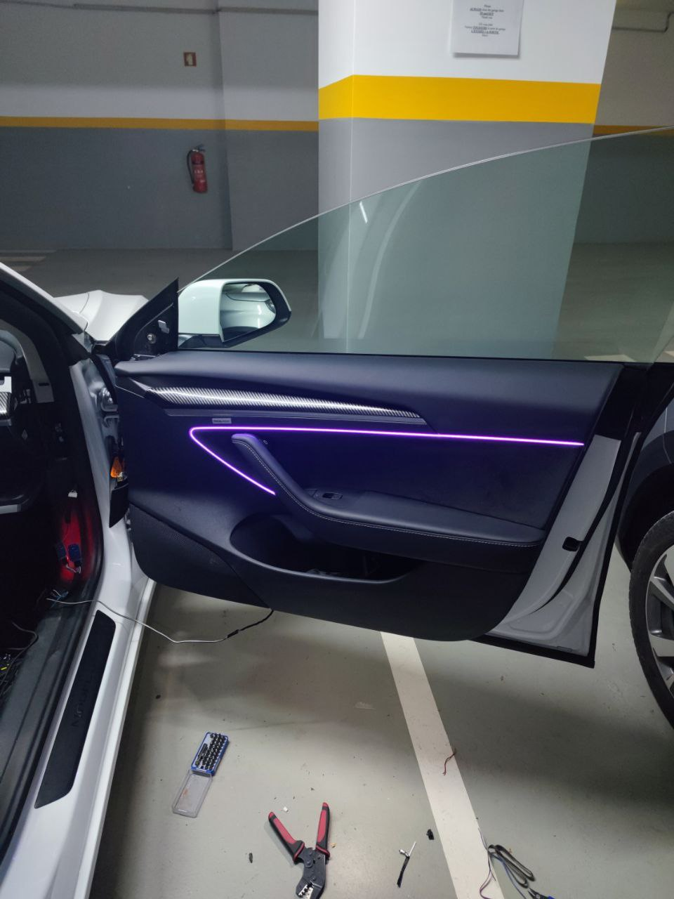
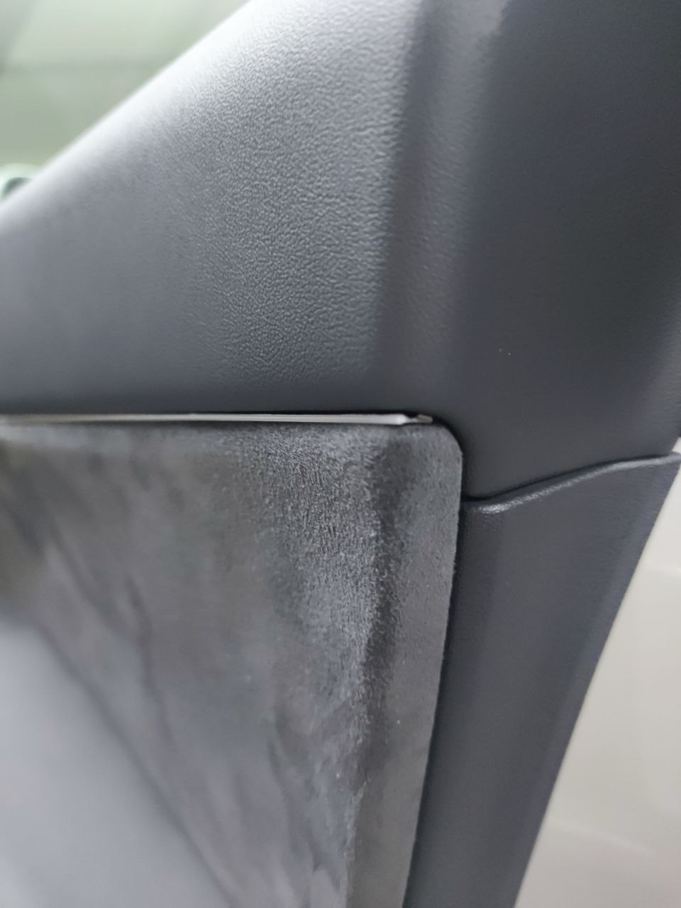
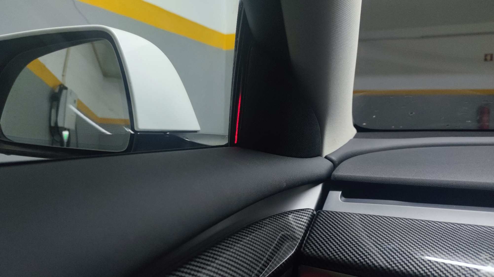
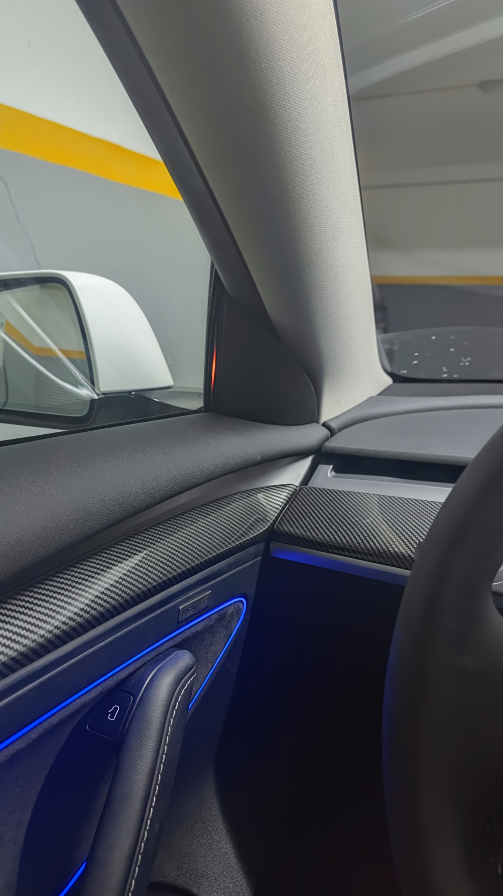
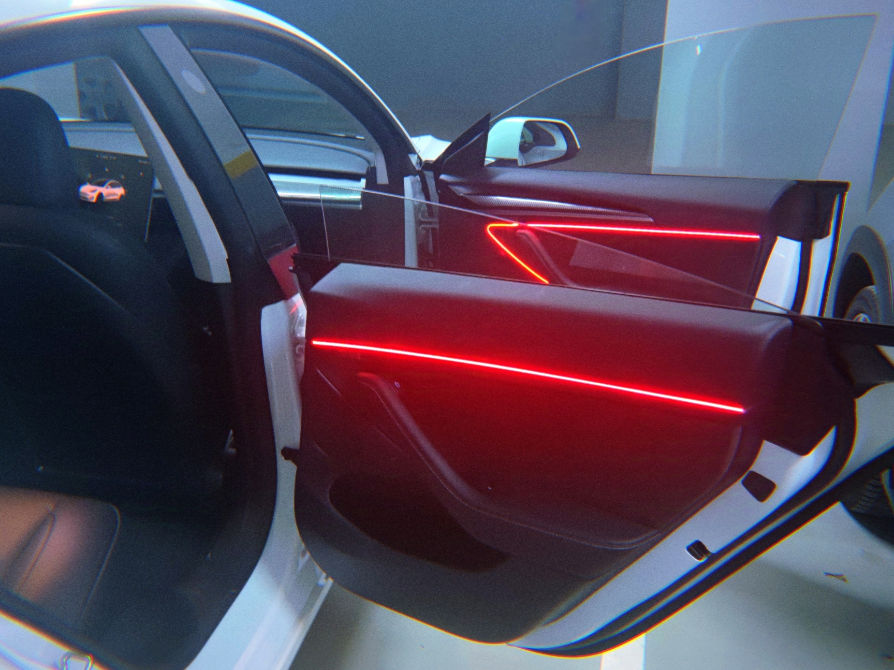

https://www.youtube.com/shorts/Xc-fdAo0e8E

# Features

What's actually implemented today:

**Door strips**
- Idle ambient gradient (blue → cyan/yellow) while the car is awake
- Welcome animation when a door closes (white sweep along the strip)
- Door-open indicator (full red) on the open door, dim red on the others
- Turn signal swipe on the front segment, side-matched to the indicator
- Blind-spot warning (red front segment)
- Combined turn + blind-spot (mixed red / yellow)
- Autopilot hands-on cues: required (subtle blue), warning (stronger blue), alert (flashing blue)
- Sleeps with the car: lights off when the center display turns off

**Mirror caps**
- Blind-spot indicator (orange center)
- Turn-into-blind-spot (red, full mirror)
- Autopilot hands-on cues mirroring the door-strip alerts

**Footwell**
- Warm white when in Park, off while driving (R / N / D)
- Two hardware paths: PWM for halogen-style fixtures, or addressable RGB

**Door pocket light**
- Simple on/off, driven either as a GPIO or as a single NeoPixel

**Auto brightness**
- Tracks the car's display backlight signal so the ambient light follows day/night
- Brightness floor when a door is open or the car is in Park

**Ambient-light setting follow**
- Mirrors the car's *Ambient Light* toggle from the UI (decoded from chassis CAN `0x273`, bit 0 of byte 5). When the driver turns ambient light off in the car, the strips fade out; turning it back on restores them.
- Some RWD trims don't have the Ambient Light setting in the UI and may not transmit the bit (or transmit it as always-zero), which would leave the strips permanently off. For those cars, set `car.useAmbientLightSetting = false;` in `setup()` (next to the existing `car.openFrunkWithDoor = true;` line). The strips then stay on whenever the center display is on.

**Connectivity & ops**
- Master runs its own Wi-Fi AP that the door slaves join (or optionally joins an existing AP)
- UDP broadcast on port `3333`; adaptive cadence (30 ms when something is happening, 10 s when idle) keeps the channel quiet
- ArduinoOTA on every node — no need to pull door cards apart for firmware updates
- Per-node role stored in EEPROM, so one firmware binary is reused for all five nodes

**Master-only CAN-out helpers** (not bound to a UI yet, but wired in `Car`): `unlock()`, `unlockRemote()`, `openFrunk()`, `wakeup()`

# Architecture

One master ESP32 + four door slaves, all on a single Wi-Fi network that the master itself hosts.

```
                 Vehicle CAN ─┐
                              ├──► [ master ESP32 ]  ──Wi-Fi/UDP──►  4× door ESP32  ──► LED strips + mirror + pocket
                 Chassis CAN ─┘                                       (one per door)
```

**Master.** Subscribes to a small set of CAN IDs on both buses:

| Bus     | ID    | Used for                                         |
|---------|-------|--------------------------------------------------|
| V-CAN   | 0x3F5 | Turn signals, headlight state, display brightness |
| V-CAN   | 0x102 | Left-side doors (open + handle pull)              |
| V-CAN   | 0x103 | Right-side doors (open + handle pull)             |
| V-CAN   | 0x2E1 | Vehicle status (incl. frunk)                      |
| V-CAN   | 0x118 | Gear selector                                     |
| C-CAN   | 0x399 | Autopilot state, blind-spot detection, hands-on   |
| C-CAN   | 0x273 | Vehicle control frame (template for TX) + ambient-light bit |

Two CAN paths are supported: external MCP2515 over SPI (plain ESP32) or the native TWAI controller (Autosports ESP32 CAN board) — see [Boards](#boards). Chassis CAN always goes through MCP2515.

The master runs a per-door state machine in `CarLight::processCarState` that maps those CAN signals into one of ~10 light states per door (`IDLE`, `DOOR_OPEN`, `TURNING`, `BLIND_SPOT`, `HANDS_ON_*`, etc.) plus one footwell state.

**Wire protocol.** Master broadcasts state to `255.255.255.255:3333`. Each packet:

```
byte 0       brightness                       (1 byte)
bytes 1..21  per door, repeated 4 times:
               state            (1 byte)
               age low → high   (4 bytes, little-endian)
```

`age` is "milliseconds since this state was entered on the master." Slaves use it to align local animation phases (turn-signal blink, hands-on flash) with the master's clock — there is no shared time synchronisation otherwise.

**Slaves.** Each slave joins the AP, picks up its UDP socket, and renders the state to:
- A long door-strip composed of *front + B-pillar + rear* segments (one physical strip, but the front and rear modules are addressed by different door nodes — front nodes drive `[0 .. front-1]`, rear nodes drive `[front+pillar .. end]`)
- A short mirror-cap strip (front doors only, but lit by the same node)
- A pocket light (GPIO or single NeoPixel)

Slaves never read the CAN bus and have no knowledge of Tesla's protocol — only the lighting state machine. Animation buffers are kept in floating-point and resolved per frame by `_fadeColor` / `_fadeBrightness`, then pushed to `Adafruit_NeoPixel` for addressable strips or to the LEDC PWM peripheral for halogen-style footwell channels.

**Why this split?**
- Centralising the LED strips on the master would mean long signal runs through the body — unreliable for WS2812-class addressable LEDs (electrical noise, timing drift).
- Putting an MCU in each door avoids cutting any factory wiring; the only thing that travels between doors is Wi-Fi.
- One-way UDP + adaptive cadence means slaves can drop in and out without master state being affected.

My TM3 is RWD, where the factory door-pocket light wires are inactive. I reuse those wires for low-voltage power delivery to each door slave. See "wiring" below.

# Requirements

## Tools
- Pliers
- Dupont terminals crimper (optional)
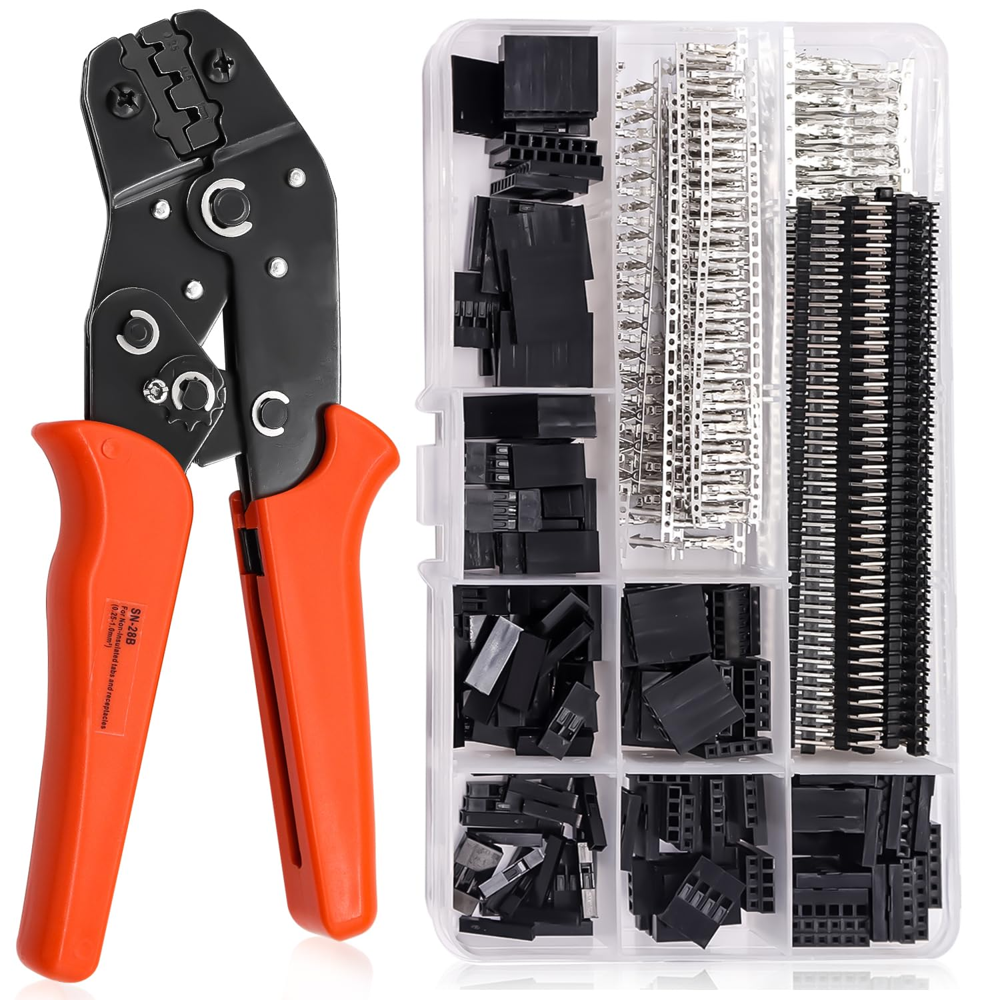
- Soldering iron
- Pry tool
- Torx set
- Needle to change pins

## Components
- ESP 32 (with USB) x5
- MCP2515 x2
- DC-DC converter (1 or more)
- Tesla CAN connector. If you can`t find one with 6 wires (2 big pins for power, which have no corresponding pins in the car and 2x2 for CAN buses), buy 2 and move pins. Or take pins from the next one, there are unused ones. 
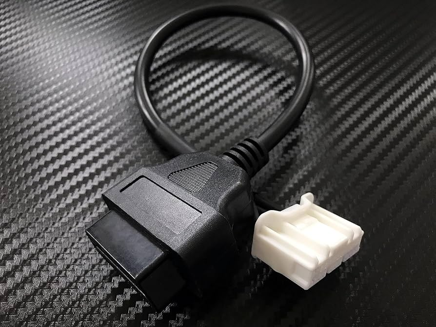
- Tesla Diagnostic Breakout (optional). Use to get power from central console socket without cutting wires.
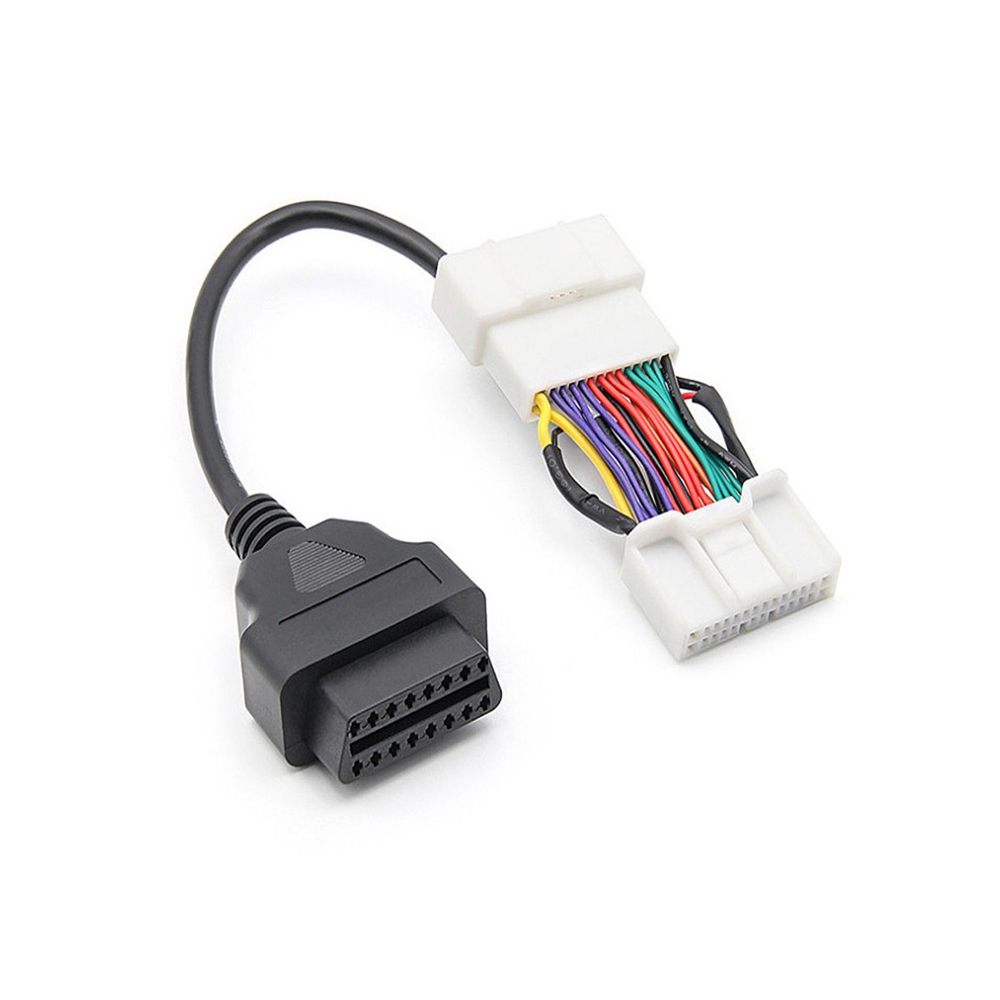
- Insulating tape
- Soundproofing tape
- Fuse with holder

**Please, make sure you know what to do and have an experience with electricity. Disconnect both batteries before proceed.
Do this at your own risk.**

# Boards

The firmware supports a few different ESP32 variants. Pick the right one for each role and set the matching `#define` / variable in `TeslaAmbientLight.ino`.

## Master

The master is wired to both Vehicle CAN and Chassis CAN. Two options:

- **Plain ESP32 + 2× MCP2515.** Default build. Both CAN buses go through external MCP2515 controllers over SPI. Uses `Car::init(vCanPin, cCanPin)` with chip-select pins 5 (V-CAN) and 13 (C-CAN). Leave `AUTOSPORT_ESP32` undefined.
- **Autosports ESP32 CAN board.** Has a built-in TWAI/CAN transceiver, so Vehicle CAN runs natively on the SoC and only Chassis CAN needs an MCP2515. Uses `Car::initAS(cCanPin, vCanRxPin, vCanTxPin)`. Define `AUTOSPORT_ESP32` (use `#define AUTOSPORT_ESP32` — note the current source uses `#ifdef`, so the value doesn't matter, only whether it's defined).

The master also brings up the Wi-Fi AP that the door slaves connect to.

## Slaves (one per door)

Any small ESP32 with enough GPIOs for `ledPin`, `pocketLedPin`, and `mirrorPin` works. The sketch ships with pin maps for three targets, selected automatically by the Arduino core's `CONFIG_IDF_TARGET_*` macros:

| Board       | `pocketLedPin` | `mirrorPin` | `ledPin` |
|-------------|----------------|-------------|----------|
| ESP32-S3    | 10             | 11          | 12       |
| ESP32-C3    | 2              | 4           | 3        |
| Plain ESP32 | 14             | 15          | 12       |

ESP32-C3 and ESP32-S3 are recommended for the doors — they're smaller, cheaper, and have native USB for OTA recovery. Plain ESP32 also works.

Each slave's role (`DOOR_FRONT_RIGHT`, `DOOR_FRONT_LEFT`, `DOOR_REAR_RIGHT`, `DOOR_REAR_LEFT`) is set per node. You can either edit `role` and reflash with `saveRoleToEEPROM = true` once per node, or hardcode it per build.

# Passwords — change before flashing

`TeslaAmbientLight.ino` ships with placeholder credentials that are public in this repository:

- `ssid = "T3LIGHT"` — the AP SSID broadcast by the master.
- `password = "12345678"` — the WPA2 password for the master AP (and the credential the door slaves use to join it).
- `passwordOTA = "12345678"` — the Arduino OTA password used by every node, master and slaves.

**You must change all three to your own values before flashing.** If you don't:

- Anyone within Wi-Fi range can join your AP using the credentials in this repo.
- Once on the AP, anyone can push arbitrary firmware to any node over OTA. The master is wired to the chassis CAN bus and can transmit unlock / frunk / wakeup frames, so this is not just a lighting concern.
- The slaves and master share one Wi-Fi network with no UDP authentication, so a peer on the AP can also send fake state packets (blind-spot / hands-on alerts) to the door modules.

Pick a long, random WPA2 password and a separate OTA password. Don't reuse `12345678`. If you fork this repo, keep your real credentials out of the commit history.

# Wiring

## Master module

Pretty standard SPI wiring. Chip Select wires should correspond to `Car.init(13, 5)` call

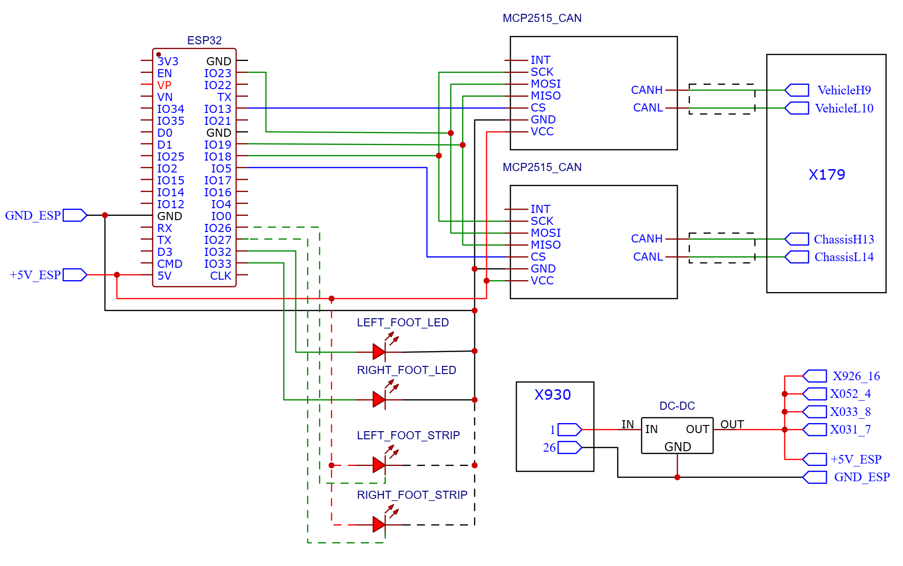

## Door module

Test LED strip wires before connecting. Mine had black wire for 5V and red for GND. RIP, LED strip.

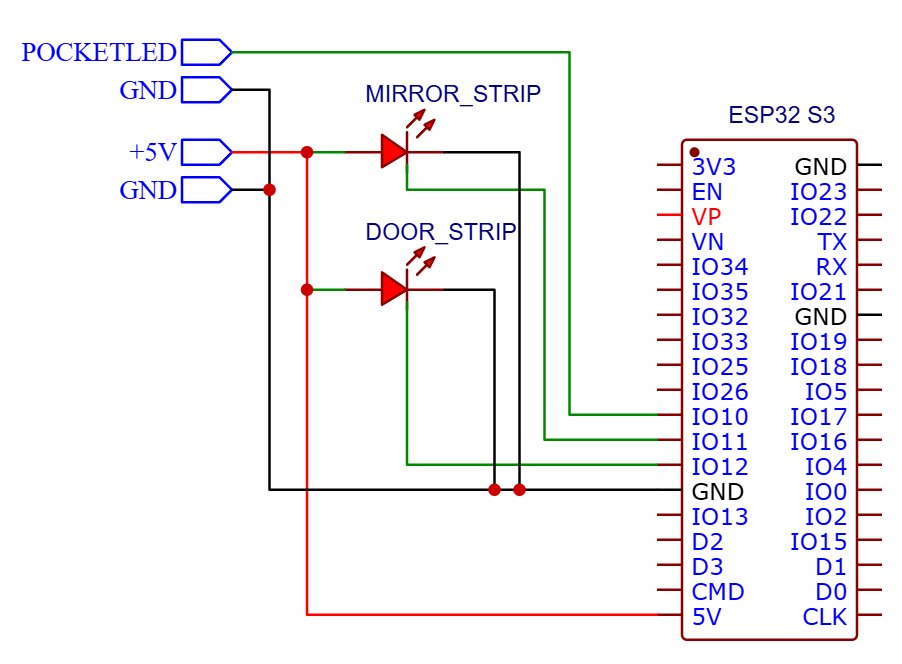

## Car connectors and pins

### CAN connector

Here how it looks. I used Tesla CAN connector, just plugged in to empty connector, just cut out OBD connector and soldered wires directly to my MCP2515 adapters. 
Don't forget to twist wires.
Refer to car wiring diagrams.
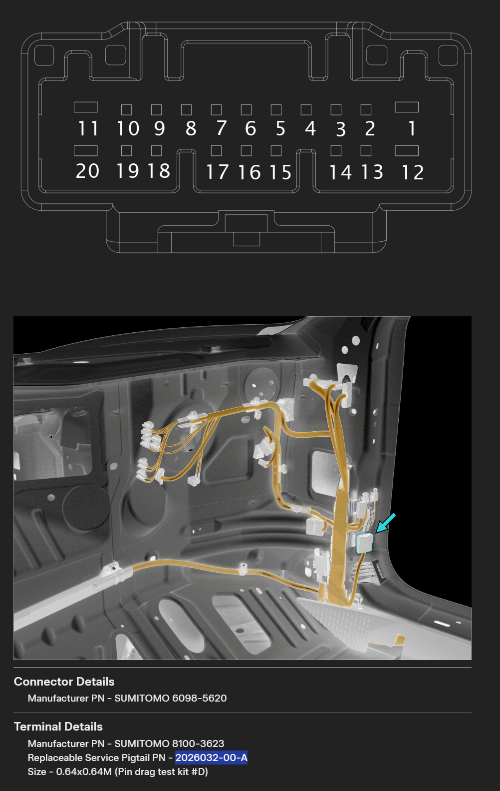
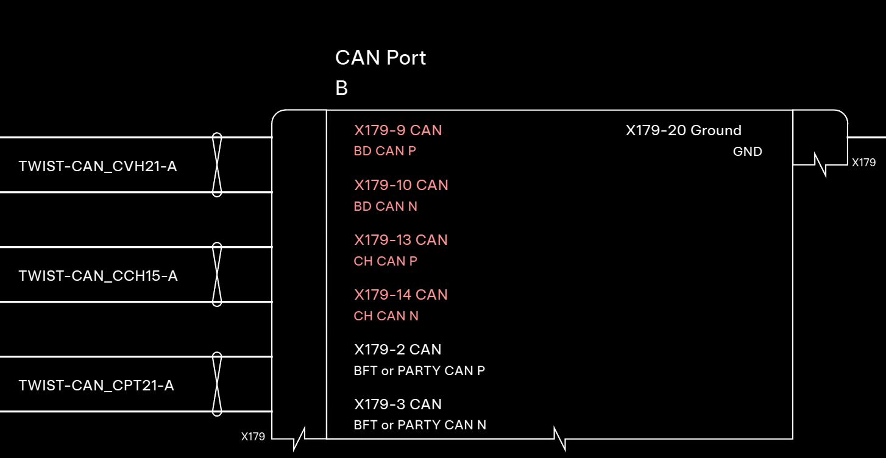

## Power connector
Use power from central console. Check polarity before connection, don't trust wire colors.
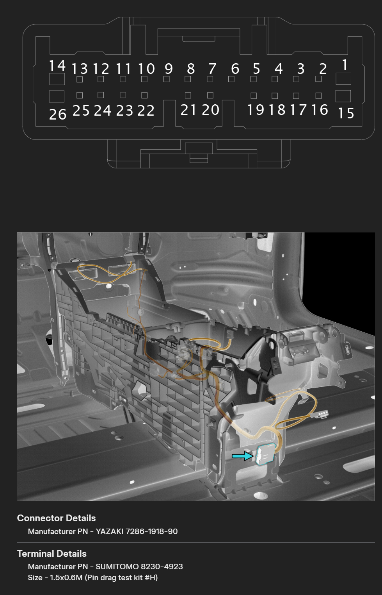
I've installed 5A fuse, put wrapped wire to under-the-glovebox area, where are a lot of space, and CAN connector located. 

## Door module power
There are 4 pins, one for each door, connected to VCLEFT and VCRIGHT, on RWD there are no voltage.
Anyway, I don't think it's a good idea to put additional load, so I've taken these pins out of the connectors and connected them to my own power source.
### Front doors
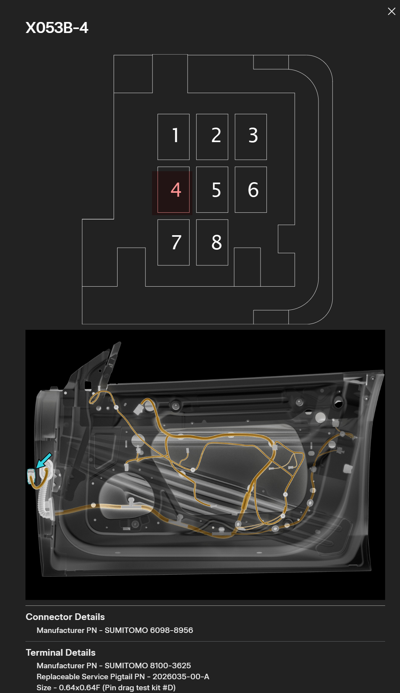

### Back doors
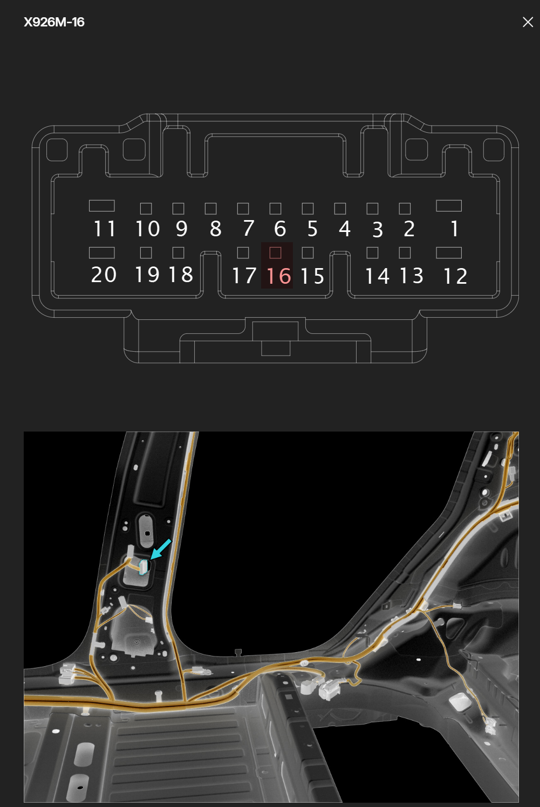
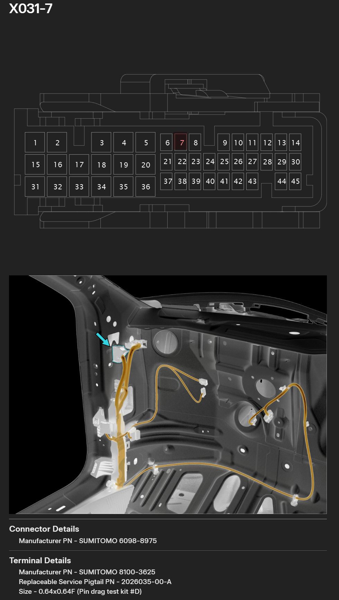

# Used resources

https://service.tesla.com/docs/Model3/ElectricalReference/prog-187/interactive/html/index.html

https://github.com/joshwardell/model3dbc

https://github.com/coryjfowler/MCP_CAN_lib

https://github.com/nmullaney/candash
